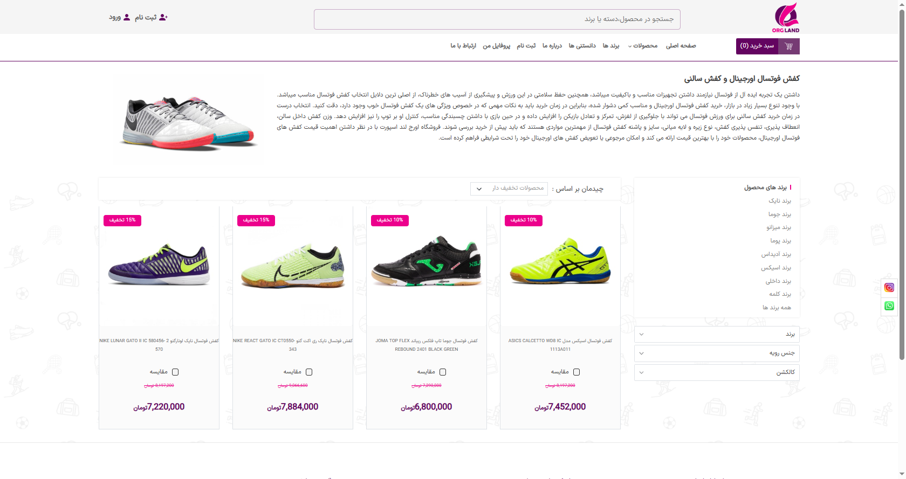
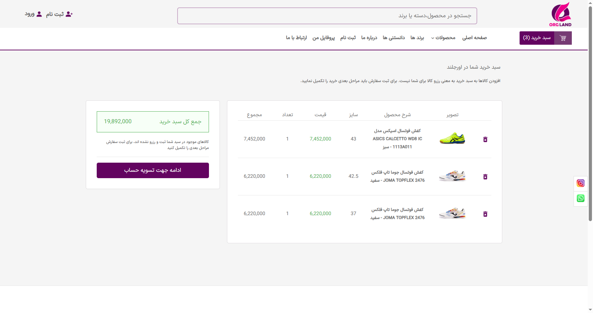

#  Online Store - React Ecommerce Project

یک فروشگاه اینترنتی ساخته‌شده با دیتابیس فیک(json-server) React، Redux Toolkit و Sass. این پروژه شامل صفحات محصول، فیلتر پیشرفته، سبد خرید، اسلایدرهای هماهنگ و کاملاً Responsive است.

---

##  ویژگی‌ها

- استفاده از **React 18** + **Redux Toolkit**
- استایل‌دهی با **Sass**
- ریسپانسیو کامل برای موبایل و دسکتاپ
- سیستم مدیریت سبد خرید
- اسلایدر تصاویر محصول با هماهنگی (Main + Thumbs)
- شافل کردن محصولات برای نمایش در اسلایدر ها و ...
- استفاده از React Router برای مسیرهای داینامیک
- ماژولار و سعی در جلوگیری کد های تکراری (کدنویسی تمیز)

---


##  دمو(Demo)

###  فیلتر محصولات

###  سبد خرید



---

##  نصب و اجرا

```bash


 1- نصب پکیج‌ها
npm install

 2- اجرای (fake api (json-server
json-server -w db.json -p8000

 3- اجرای پروژ 
npm run dev
